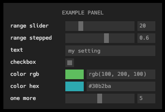

# control-panel

[![NPM version][npm-image]][npm-url]
![experimental][experimental-image]
[![js-standard-style][standard-image]][standard-url]


Embeddable panel of inputs for adding parameter selection to your app or visualization. Modern and minimalist design. Fully encapsulated module including JS and CSS. Can easily be added to any app or page. Heavily inspired by [`dat-gui`](https://github.com/dataarts/dat.gui), but streamlined, simplified, and written as a npm module for use with browserify.

**[live demo](http://control-panel.surge.sh)**

[](http://control-panel.surge.sh)[](http://control-panel.surge.sh)

----------------

> Supports the following input types

> `range` • `checkbox` • `text` • `color` • `button`

----------------

> Includes the following themes

> `dark` • `light`

Want to contribute a new theme or input type? Submit a PR!

## install

Add to your project with

```
npm install control-panel
```

## example

Create a panel with four elements and add to your page in the top right.

```javascript
var control = require('control-panel')

var panel = control([
  {type: 'range', label: 'my range', min: 0, max: 100, initial: 20},
  {type: 'range', label: 'log range', min: 0.1, max: 100, initial: 20, scale: 'log'},
  {type: 'text', label: 'my text', initial: 'my cool setting'},
  {type: 'checkbox', label: 'my checkbox', initial: true},
  {type: 'color', label: 'my color', format: 'rgb', initial: 'rgb(10,200,0)'},
  {type: 'button', label: 'gimme an alert', action: function () {alert('hello!');}}
], 
  {theme: 'light', position: 'top-right'}
)
```

## usage

#### `panel = control([input1, input2, ...], [opts])`

The first argument is a list of inputs. Each one must have a `type` and `label` property, and can have an `initial` property with an initial value. For example,

```javascript
{type: 'checkbox', label: 'my checkbox', initial: true}
```

Each `type` must be one of `range` • `input` • `checkbox` • `color`. Each `label` must be unique. 

Some types have additional properties:
- Inputs of type `range` can specify a `min`, `max`, and `step` (or integer `steps`). Scale can be either `'linear'` (default) or `'log'`. If a log scale, the sign of `min`, `max`, and `initial` must be the same and only `steps` is permitted (since the step size is not constant on a log scale).
- Inputs of type `color` can specify a `format` as either `rgb` • `hex` • `array`
- Inputs of tyep `button` can specify an `action` callback. Button inputs are not reflected in the state and do not trigger an `'input'` event.

The following optional parameters can also be passed as `opts`
- `root` root element to which to append the panel
- `theme` can specify `light` • `dark` or provide an object (see [`themes.js`](themes.js) for format)
- `title` a title to add to the top of the panel
- `width` width of panel in pixels
- `position` where to place the panel as `top-left` • `top-right` • `bottom-left` • `bottom-right`, if `undefined` will just use relative positioning

#### `panel.on('input', cb(data))`

This event is emitted every time any one of the inputs change. The callback argument `data` will contain the state of all inputs keyed by label such as:

```javascript
{'my checkbox': false, 'my range': 75}
```

[npm-image]: https://img.shields.io/badge/npm-v1.1.1-lightgray.svg?style=flat-square
[npm-url]: https://npmjs.org/package/control-panel
[standard-image]: https://img.shields.io/badge/code%20style-standard-lightgray.svg?style=flat-square
[standard-url]: https://github.com/feross/standard
[experimental-image]: https://img.shields.io/badge/stability-experimental-lightgray.svg?style=flat-square
