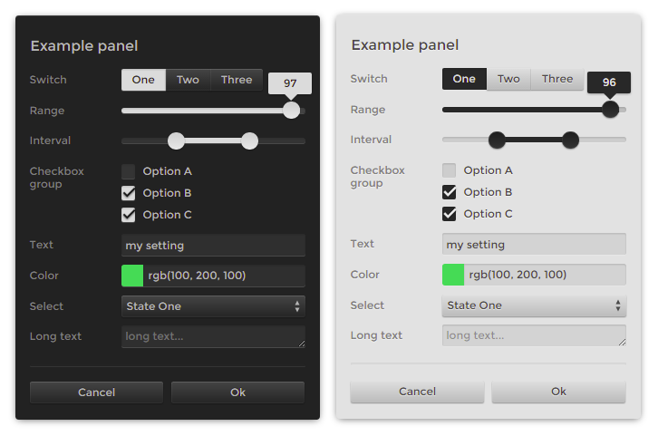

# settings-panel

Settings panel for tweaking apps, demos or tests. Pass values, get controls.

[](https://dy.github.io/settings-panel/)

```js
import settings from 'settings-panel'

const state = settings({
  enabled: true,
  volume: 0.8,
  color: '#4a90d9',
  quality: ['auto', 'low', 'high'],
  reset: () => location.reload()
})

state.volume = 0.5  // UI updates
```


## [Controls](docs/controls.md)

Types are inferred from values.

| Type | Inferred from |
|------|---------------|
| `boolean` | `true`, `false` |
| `number` | `123` |
| `slider` | `0.5` (normalized 0-1), or `{ min, max }` |
| `text` | `'hello'` |
| `textarea` | `'line one\nline two'` (multiline) |
| `color` | `'#hex'`, `'rgb()'`, `'hsl()'` |
| `select` | `['a', 'b', 'c']` or `{ options: [] }` |
| `button` | `() => {}` |
| `folder` | `'group.key'` dot-notation |

```js
settings({
  // Inferred
  debug: false,
  gain: 0.5,

  // Explicit
  frequency: { type: 'slider', min: 20, max: 20000, scale: 'log' },
  palette: { type: 'color', variant: 'swatches' }
})
```


## Themes

The [theme gallery](index.html) compares identical specimens and provides a live
preview with time of day, accent, density, and supported corner/scale controls.
Use theme exports the current JavaScript or CSS; the link button shares its axes.
The original editor is available in the [playground](demo/playground.html).

Ten themes, all functions: `theme(axes?) → CSS string`.

| Import | Name | Character |
|--------|------|-----------|
| `settings-panel/theme/default` | **soft** | Gentle shadows, generous radius. The mainstream baseline. |
| `settings-panel/theme/swiss` | **swiss** | No shadows, grid-pure, typographic hierarchy. |
| `settings-panel/theme/skeu` | **skeu** | Realistic textures, directional lighting. |
| `settings-panel/theme/brutal` | **brutal** | Hard offset shadows, thick borders, zero radius. |
| `settings-panel/theme/terminal` | **terminal** | Monospace on a character-cell grid, inverse video, no depth. |
| `settings-panel/theme/neu` | **neu** | Paired inset/outset shadows, same-surface color. |
| `settings-panel/theme/porcelain` | **porcelain** | Glazed ceramic face, mineral rim, embossed relief. |
| `settings-panel/theme/glass` | **glass** | `backdrop-filter` blur, translucent surfaces. |
| `settings-panel/theme/lab01` | **lab01** | Frosted glass with gradient borders, noise texture. |
| `settings-panel/theme/control-panel` | **control-panel** | freeman-lab/control-panel reproduction. |

```js
import settings from 'settings-panel'
import skeu from 'settings-panel/theme/skeu'

settings(schema, {
  theme: skeu({ shade: '#1a1a1a', accent: '#8855cc', spacing: 0.3 })
})
```

Themes are functions: axes in, CSS out. Core axes: `shade`, `accent`, `spacing`, `size`, `weight`, `roundness`. Some themes add extras: `skeu`/`brutal` add `bevel`; `neu` adds depth, diffusion, lighting contrast/direction, and matte grain; `porcelain` adds a ceramic lip and embossed relief; `glass` adds `blur`; `terminal` adds `leading`. See [axes](docs/axes.md).


## [Options](docs/options.md)

```js
settings(schema, {
  container: '#app',
  title: 'My Panel',
  theme: skeu({ shade: '#2a2a2a' }),
  collapsed: false,
  persist: 'my-app',
  key: 'h',
  onChange: (state) => console.log(state)
})
```

## [Signals](docs/signals.md)

State is a signals store. Subscribe via `effect`, swap signal implementation via `use()`.

```js
import settings, { effect } from 'settings-panel'

const state = settings({ volume: 0.8 })

effect(() => audio.gain.value = state.volume)
```

```js
// Use @preact/signals instead of built-in
import { use } from 'settings-panel'
import * as signals from '@preact/signals'
use(signals)
```


## Alternatives

<sup>[tweakpane](https://github.com/cocopon/tweakpane) · [leva](https://github.com/pmndrs/leva) · [lil-gui](https://github.com/georgealways/lil-gui) · [uil](https://github.com/lo-th/uil) · [dat.gui](https://github.com/dataarts/dat.gui) · [control-panel](https://github.com/freeman-lab/control-panel) · [oui](https://github.com/wearekuva/oui)</sup>

<p align=center><a href="https://github.com/krsnzd/license/">ॐ</a></p>
